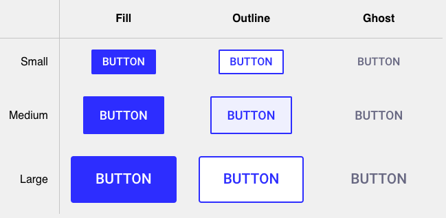

# Button Exercise

This was a really cool, challenging, and eye-opening CSS exercise to create a button component that could be dynamically styled.

I think part of the idea was to show how some of the things we see in Bootstrap can be done ourselves, albeit it's a bit more complex than we might have thought!

So we have a button component, and it can differ in two different ways: size and 'variant'.

The approach taken by Josh was to achieve MVP's.

The first MVP is to have every button look like the medium sized filled in button.

The second MVP was to factor in the size. Josh used CSS variables. Essentially, the way it works is you do your logic outside, and you pass all your variables in a `style` prop. Then, in your CSS area, you have access to those variables, and can use them. This way, your CSS area is fairly clean.

The third MVP was to factor in the variant. Josh used the styled-components trick of **composition**. This is where we use one component to serve as the base for other components.

Finally, add some `hover` and `focus` stuff, and fine-tune according to Figma design.

Useful stuff, like using `transparent`, `currentColor`, `outline-offset`.

Experience gained with:

- styled-components
- using composition in styled-components
- methodologies for tackling such problems
- Figma
- and React, I guess

Appreciation gained for:

- developers who work on component libraries 😅

Credits:

- <a href="https://codesandbox.io/s/jwc-button-exercise-eqm7e?file=/src/Button.js" target="_blank">Starter files on CodeSandbox</a>
- <a href="https://courses.joshwcomeau.com/css-for-js" target="_blank">CSS for JavaScript Developers</a>
